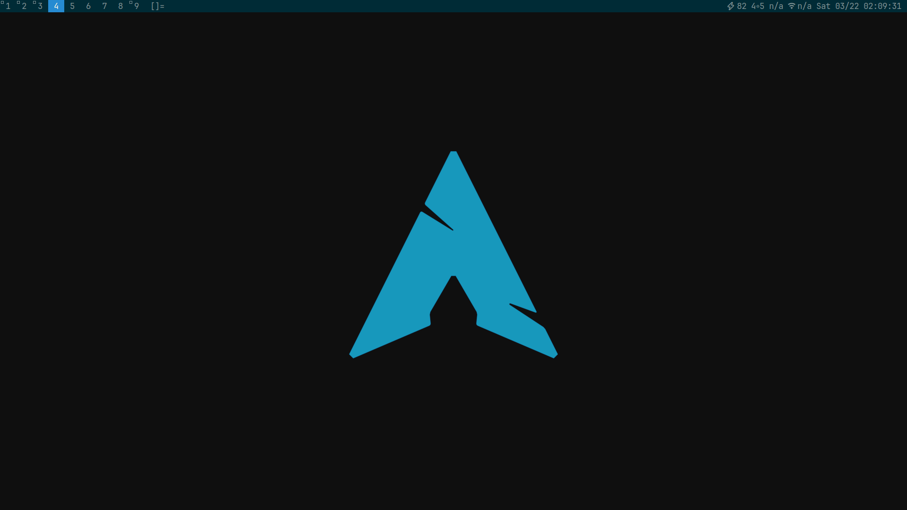

# Custom slstatus Build

A minimalist, optimized build of the suckless status monitor configured for Arch Linux and dwm.

## Overview

This repository contains a custom configuration of slstatus, the suckless status monitor that provides system information to dwm. This build is optimized for WiFi-only Arch Linux systems with a focus on minimal resource usage and essential system metrics.

## Configuration

This build displays the following information in the status bar:

- Battery percentage (BAT0)
- CPU usage percentage
- RAM usage percentage
- WiFi signal strength percentage (wlan0)
- WiFi ESSID (wlan0)
- Date and time (formatted as `Day MM/DD HH:MM:SS`)

Update interval is set to 1000ms (1 second).

## Screenshot



## Dependencies

- Xlib header files
- Working dwm installation
- Font with Unicode symbols support (for status icons)

## Installation

1. Clone this repository:
   ```bash
   git clone https://github.com/TechEliteAutomation/bld/slstatus.git
   cd bld/slstatus
   ```

2. Build and install:
   ```bash
   make clean install
   ```

   Note: You may need to run the install command with sudo depending on your installation prefix.

3. Add slstatus to your `.xinitrc` or other startup script:
   ```bash
   # Start slstatus
   slstatus &
   ```

## Customization

This build uses a specific set of Unicode symbols for system metrics. If you want to modify the displayed information or formatting:

1. Edit `config.h` in the source directory
2. Rebuild with `make clean install`

### Common modifications:

- To change update frequency, modify the `interval` value in `config.h`
- To add or remove displayed metrics, edit the `args[]` array
- To change the network interface, replace "wlan0" with your interface name

## Features Available

The full slstatus tool supports the following metrics which can be added to your build:

- Battery status (percentage/state/time)
- CPU metrics (usage and frequency)
- Disk status (free, total, used, percentage)
- Network metrics (IP addresses, speeds)
- Memory and swap usage
- Temperature readings
- System information (uptime, kernel version, hostname)
- And more (see config.h for complete list)

## License

This project is licensed under the MIT/X Consortium License - see the original slstatus repository for details.

## Related Projects

[Tech Elite Automation](https://github.com/TechEliteAutomation) for more Arch Linux tools and automation scripts.

---

*This is a fork of [slstatus](https://tools.suckless.org/slstatus/) by suckless.org*
